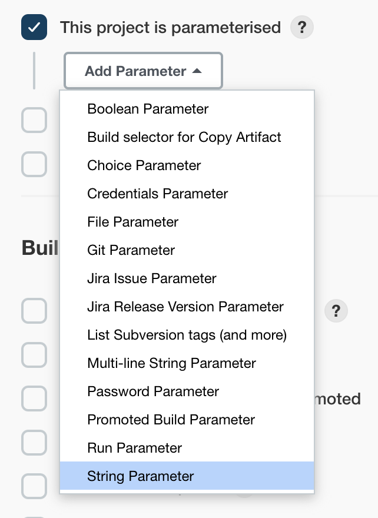
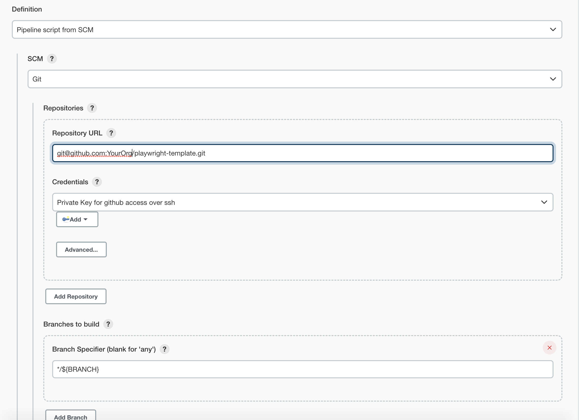

<picture>
  <source media="(prefers-color-scheme: dark)" srcset="https://www.developer.davra.com/davralogo.svg">
  <source media="(prefers-color-scheme: light)" srcset="ttps://www.developer.davra.com/davralogo-home.svg">
  
</picture>

---

## Table of Contents

- [Davra Test Automation Template - TypeScript](#davra-test-automation-template---typescript)
  - [Getting started](#getting-started)
    - [Prerequisites](#prerequisites)
    - [Installation](#installation)
    - [Setting up environment variables](#setting-up-environment-variables)
    - [Running tests](#running-tests)
  - [Features](#features)
    - [Parallel execution](#parallel-execution)
    - [Cross-browser testing](#cross-browser-testing)
    - [Global setup and teardown](#global-setup-and-teardown)
    - [Fixtures](#fixtures)
    - [Page Objects](#page-objects)
    - [Visual testing](#visual-testing)
    - [Reporting](#reporting)
  - [CI](#ci)
    - [Jenkins & Docker](#jenkins--docker)
      - [Credentials](#credentials)
      - [Environment variables](#environment-variables)
      - [Creating and parametrising the Jenkins pipeline](#creating-and-parametrising-the-jenkins-pipeline)
    - [Other CI configurations](#other-ci-configurations)

# Davra Test Automation Template - TypeScript

This is a sample [Playwright](https://playwright.dev/) & TypeScript project for automated testing of applications built on the Davra platform.

## Getting started

### Prerequisites

- Compatible OS: Windows, MacOS 11 (Big Sur) or above, Linux (Ubuntu 18.04, 20.04 or 22.04)
- Node v14 or above
- Running [Davra sample application](https://github.com/Davra/sample-iot-app)

If you do not meet the OS requirement, you can still [run the tests using Playwright's official Docker image](https://playwright.dev/docs/docker#usage)

### Installation

Before running the tests, you will need to install dependencies

```sh
npx playwright install-deps # Only when installing Playwright for the first time
npm install
```

### Setting up environment variables

All environmental setup is handled in the `env.ts` file. \
Specify the environment you wish to use and provide user credentials.

```sh Bash
export PLATFORM_URL=https://your-platform-url.davra.com     # url for the Davra platform
export BASE_URL=https://your-app-url.apps.davra.com/        # url for the application
export ADMIN_USERNAME=someuser
export ADMIN_PASSWORD=somepassword
```

Optional setup:

```sh
# Authentication method to use. Available options are 'Basic' and 'OAuth' (default)
export AUTH_METHOD=OAuth
```

To confirm the environment was configured correctly, run `npm test`. \
This will run all the tests, after which the output should contain something like this:

      18 passed (60s)

    To open last HTML report run:

      npx playwright show-report

You should also see a new file created in the root folder of the project: `authState.json`.
If the tests don't run as expected, see Playwright's [Troubleshooting Guide](https://playwright.dev/docs/troubleshooting).

### Running tests

Use `npm test` to run the tests using default settings.
This will execute all tests found in the `tests` folder in headless mode using the default number of workers on all configured browsers.

[Playwright CLI](https://playwright.dev/docs/running-tests#command-line) can be used to set custom parameters of the test run, such as headed mode, specific project to run, number of workers etc.
For example, you could run tests in headed mode on Chromium only with parallel execution disabled (single worker):

```sh
npx playwright test --headed --project=chromium --workers 1
```

## Features

### Parallel execution

Tests run in parallel at file level, meaning that tests within the same file will not run in parallel unless specified otherwise. \
This can be easily done by adding `.parallel` to the `test.describe` block.

The number of tests running concurrently (workers) can be configured in the `playwright.config.ts` file. Different values can be used for running tests locally and on CI:

```ts
  workers: process.env.CI ? 1 : undefined,
```

Another way to run the tests with a specific number of workers:

```sh
npx playwright test --workers 10
```

The desired number of workers will depend on the resources on the machine running the tests and the performance of the application under test. \
[Playwright parallel execution and sharding guide](https://playwright.dev/docs/test-parallel)

### Cross-browser testing

Playwright comes with support for Chromium, Firefox and Webkit, as well as emulation options for mobile devices.
By default, the tests will only run on Chromium.
To run the tests on additional browsers, they need to be added to the `projects` array in `playwright.config.ts`.
The configuration for commonly used browsers is already available in the config file and can be enabled by uncommenting the relevant objects within the `projects` array.

```ts
/* Configure projects for major browsers */
projects: [
  {
    name: "chromium",
    use: {
      ...devices["Desktop Chrome"],
    },
  },

  /* Uncomment to run tests on firefox as well */
  // {
  //   name: 'firefox',
  //   use: {
  //     ...devices['Desktop Firefox'],
  //   },
  // },
];
```

Read more about [Playwright project configuration](https://playwright.dev/docs/test-advanced#projects)

### Global setup and teardown

Global setup and teardown functions run before and after running all tests, respectively. \
By default, `global-teardown.ts` is enabled but serves no purpuse. Any actions that must be completed after running the tests can be added here. Keep in mind that any post-test cleanup should be done at test level, not in the global teardown.

Default purpose of `global-setup.ts` is handling authentication. If credentials are provided, it will attempt to login and save the authentication state in `authState.json`. This state will then be used by all tests, so they can navigate directly to the application and skip login. If you need to run a test as an unauthenticated user, it can be done using the `noAuthPage` [fixture](#fixtures).

### Fixtures

Fixtures are a key feature in Playwright. They allow you to establish the environment for any given test and tear it down once it's done.
Apart from the [default fixtures](https://playwright.dev/docs/test-fixtures#built-in-fixtures), additional ones are defined in `fixtures.ts`:

- `baseRequest` - provides a [request context](https://playwright.dev/docs/api/class-apirequestcontext) for the platform
- `appRequest` - provides a [request context](https://playwright.dev/docs/api/class-apirequestcontext) for the app
- `apiUtils` - API utilities for interacting with the platform
- `noAuthPage` - Like the default `page` fixture, but without authentication
- `appRequestNoAuth` - `appRequest` without authentication
- `testDevice` - creates a unique device and deletes it after the test

Page Object fixtures:

- `navMenu`
- `devicesPage`
- `deviceDetailsPage`

Each Page Object fixture will create a new instance of [Page], navigate to its `baseUrl` and pass the instantiated Page Object to the test.

Here's how fixtures can be used:

```ts
// mytest.spec.ts
import { test } from "../fixtures";

test("My test with fixtures", async ({ apiUtils, deviceDetailsPage }) => {
  await apiUtils.crud.getDevices(); // Get all devices from the platform
  const { detailsPage, testDevice } = deviceDetailsPage;
  await expect(detailsPage.name).toHaveText(testDevice.name); // Expected device name is displayed
});
```

You can configure your own fixtures in the `fixtures.js` file. They will be available to all tests. Alternatively, the fixtures can be defined inside a test file if they are to only be used within it. \
[Read more about fixtures](https://playwright.dev/docs/test-fixtures)

### Page Objects

Page Object Model can be implemented with Playwright. This project contains some basic examples in the `pages` folder. All Page Objects are contained in the `PageObjects` class in `index.js`. This project overwrites the default `page` fixture in order to grant it access to Page Objects:

```ts
// fixtures.ts
page: async ({ page }, use) => {
  const extendedPage: PageWithPageObjects = Object.assign(page, {
    objects: new PageObjects(page),
  });
  await use(extendedPage);
};
```

That means any `page` can instantiate Page Objects for itself.

```ts
// example.spec.ts
import { test } from "../fixtures";

test("This test will run second", async ({ page }) => {
  const loginPage = page.objects.loginPage;
  await loginPage.goto();
  await loginPage.login();
});
```

The recommended approach is to create a fixture for each distinct page by extending the default `page` fixture, then navigating to the correct url and passing the instantiated Page Object to the test.

```ts
// fixtures.ts
devicesPage: async ({ page }, use) => {
  const devicesPage = page.objects.devicesPage;
  await devicesPage.goto(); // The correct url is specified in the Page Object constructor
  await use(devicesPage);
};
```

```ts
// example.spec.ts
import { test, expect } from "../fixtures";

test("This tests starts at the Devices page", async ({ devicesPage }) => {
  await expect(devicesPage.title).toBeVisible();
});
```

### Visual testing
Playwright can compare images to verify pixel difference is within acceptable range. See `tests/visual-assertions.spec.ts` for how this can be implemented.

If you need to generate new snapshots, use Docker to create them in an environment that matches your CI. If the tests will run inside a Docker container or on Linux, you can use Playwright's Docker image to generate snapshots.

1. Start by running a new container. Make sure image version matches your Playwright version (`1.27` by default)
      ```bash
      docker run --rm --network host -v $(pwd):/playwright/ -w /playwright/ -it mcr.microsoft.com/playwright:v1.27.0-focal /bin/bash
      ```
2. [Set up environment variables](#environment-variables) inside the container
3. Run tests and generate new snapshots
      ```bash
      export CI=true  # To include visual assertions in the test suite
      npm install
      npx playwright test --update-snapshots
      ```
4. Exit the container
5. Commit and push generated snapshots
   
### Reporting

Two reporters are enabled by default:

- `list` reporter, which is responsible for the console output while running tests
- `html` reporter, which generates a report in the `playwright-test` folder
  To view the html report from the latest test run:

```sh
npx playwright show-report
```

If a test fails, Playwright will retain the trace and a screenshot. Both will be attached to the failing test in the html report.
More options, including **recording videos**, are described in detail in [Playwright Configuration](https://playwright.dev/docs/test-configuration) docs.

Additional reporters can be configured in `playwright.config.ts`, full list available [here](https://playwright.dev/docs/test-reporters#built-in-reporters).

## CI

Once you [create a repository using this template](https://docs.github.com/en/repositories/creating-and-managing-repositories/creating-a-repository-from-a-template), you can integrate your tests with CI

### Jenkins & Docker

This project contains a Jenkinsfile that can be used to run tests inside a Docker container on your Jenkins worker.
In order to set up a pipeline, you will first need to configure the environment variables and credentials.

#### Credentials

The Jenkinsfile contains a reference to admin credentials - `SAMPLE_APP_CREDENTIALS`:

```groovy
withCredentials([
        usernamePassword(credentialsId: 'SAMPLE_APP_CREDENTIALS', passwordVariable: 'ADMIN_PASSWORD', usernameVariable: 'ADMIN_USERNAME'),
]) {
```

[Configure admin credentials](https://www.jenkins.io/doc/book/using/using-credentials/#configuring-credentials) on Jenkins and replace `SAMPLE_APP_CREDENTIALS` in the Jenkinsfile with the name you chose when configuring those credentials.

#### Environment variables

`PLATFORM_URL`, `BASE_URL` and `AUTH_METHOD` can have their values hardcoded in Jenkinsfile. Simply replace the default values with ones matching your
environment and push the changes. If you prefer not to use hardcoded values or expect to run the tests on more than one environment, you can parametrise the Jenkins job instead (see next step)

```groovy
docker.image('mcr.microsoft.com/playwright:v1.27.0-focal')
        .inside('--ipc=host --init ' +
                '-e "PLATFORM_URL=https://your-platform-url.davra.com" ' +  // Replace this
                '-e "BASE_URL=https://your-app=url.apps.davra.com/" ' +     // and this
                '-e "AUTH_METHOD=OAuth"') { c ->                            // and this if not using OAuth
            sh 'npm install'
            sh 'npm test'
        }
```

#### Creating and parametrising the Jenkins pipeline

1. Open Jenkins and select `New Item` from the menu
2. Select `Pipeline` and give it a name, then click 'OK'<br>
   

3. Select `This project is parameterised` and add a string parameter<br>
   

4. Set 'Name' to `BRANCH` and 'Default Value' to `main`<br>
   

5. From the pipeline definition dropdown, select `Pipeline script from SCM`
6. Select `git` SCM
7. Provide the GitHub credentials and url to your repository
8. In 'Branches to build', enter `*/${BRANCH}`<br>
   

9. Save the pipeline configuration

That's it! Your pipeline is ready to run the first build. Setting the `BRANCH` parameter allows you to specify which branch should be used for each build.

### Other CI configurations

For running Playwright on other CI environments, see example [CI configurations](https://playwright.dev/docs/ci#ci-configurations)
